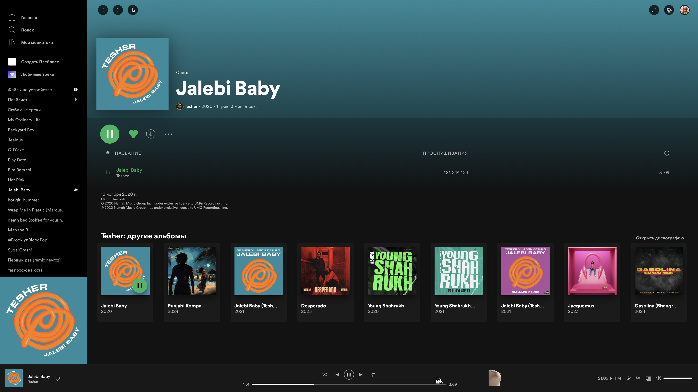

## 2020-2021 Spicetify Theme (For me)

## Description

This theme doesn't just replicate the look of the old Spotify design from 2020, it directly copies its design for the latest versions of Spotify! All the small details, indents, shadows, icons, fonts, everything was repeated almost thoroughly, almost only with CSS, minimum JS.

# Warning!
### This repo is just an archive of my theme. I made this theme for myself, so I do not guarantee stability, refinement or functionality! The theme has been tested only on macOS with the custom xpui, other installed extensions, snippets and custom apps, I cannot guarantee identical performance on other versions and systems!

## Important!
Be sure to additionally do:
- Enable compact library in the settings and then disable the "Enable Your Library X Enhancements"
- Set in the "Show global nav bar with home button, search input and user avatar" to "control"
- Disable the "Enable carousels on home"